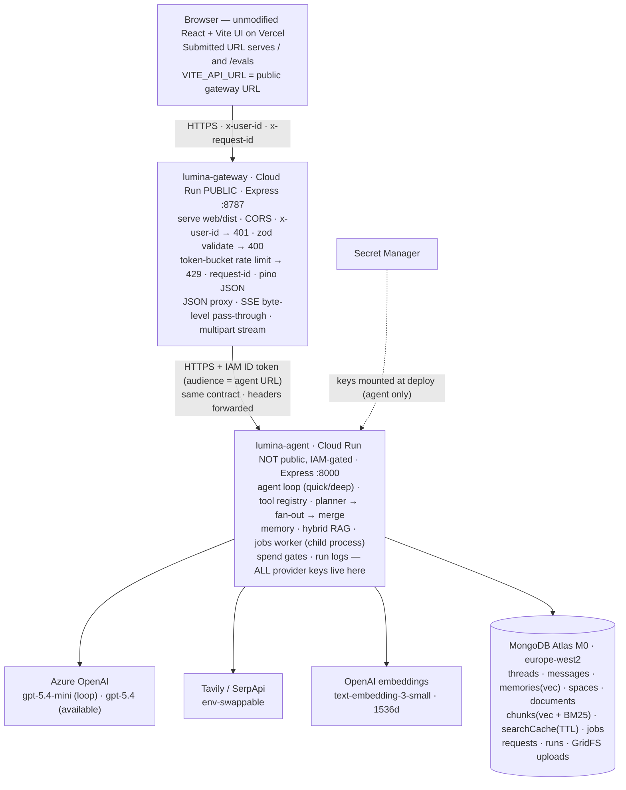
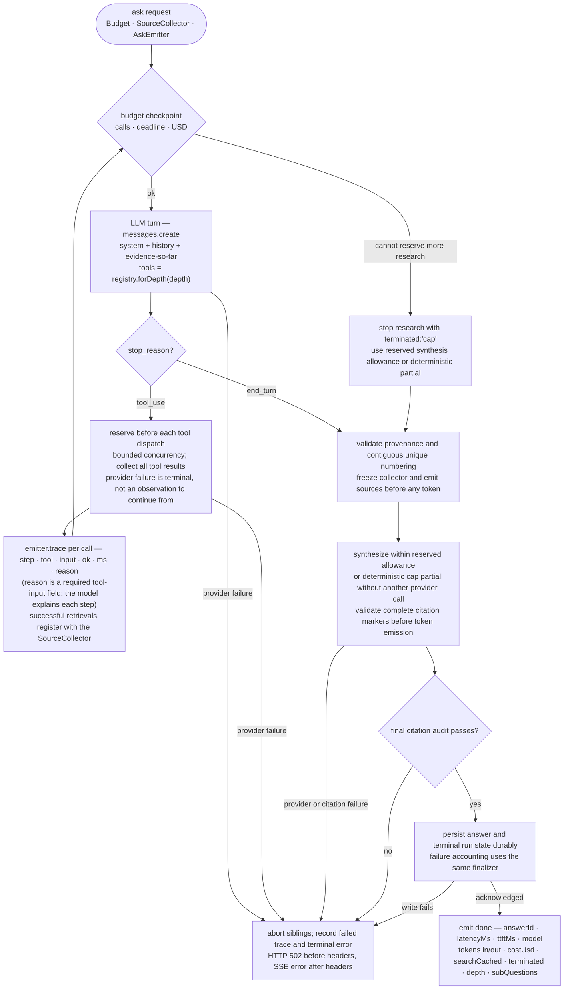
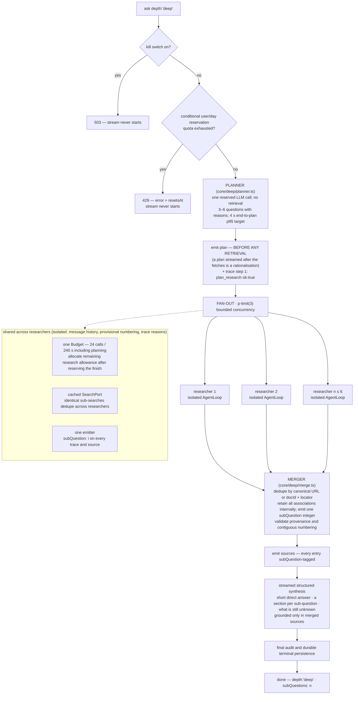
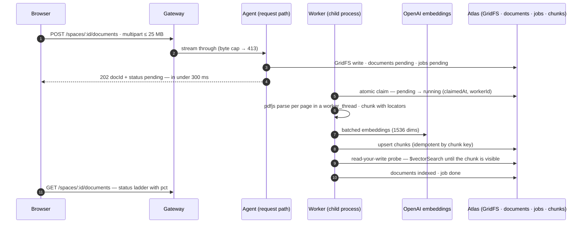
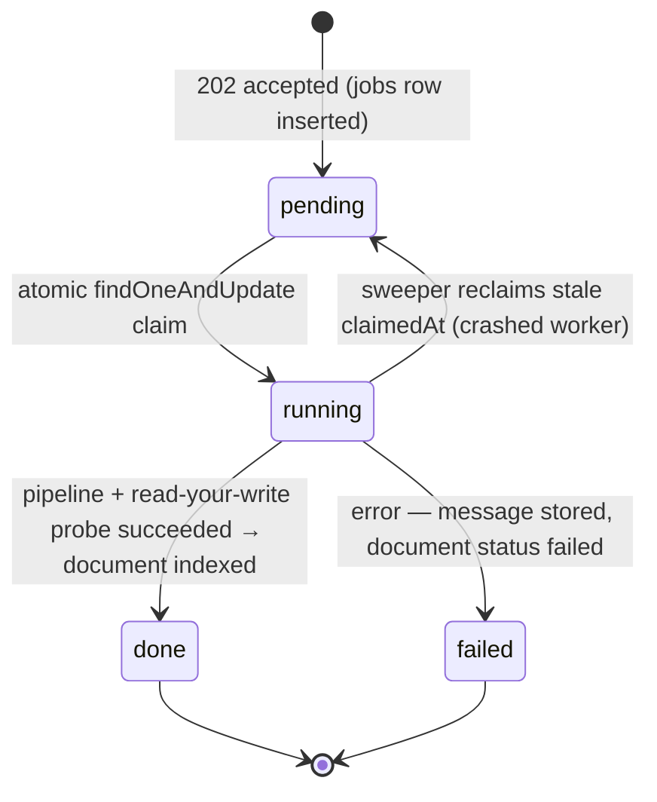
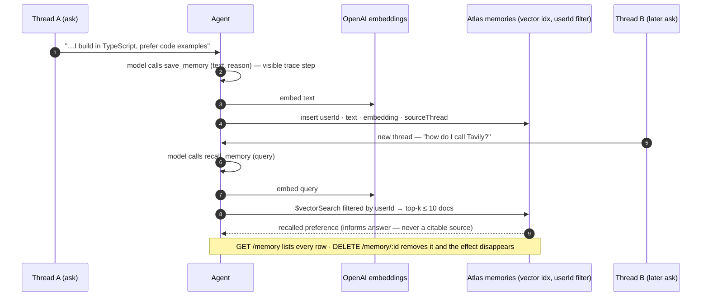
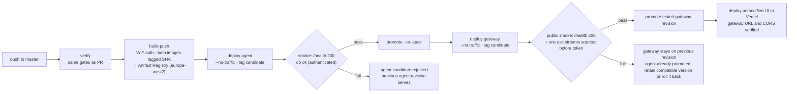

# LUMINA — Architecture & Implementation Plan

> **Scope.** This document is the engineering blueprint for LUMINA's two backend services and
> their deployment on **Google Cloud**, with the submitted UI on **Vercel**. It covers the high-level design, the low-level module
> design, data and information flow, the agent loop and deep-search handoff, the guardrails a
> production system needs, containerization, and the CI/CD + deployment plan.
>
> **Authority.** Nothing here overrides the assignment's sources of truth: `packages/contract/`
> (executable schemas), `benchmark/sla.json`, `expectations.json`, `eval/rubric.json`, and
> `AGENTS.md`. Where this document and those disagree, they win and this document is stale.
>
> **What gets built.** New code lives only in `backend/gateway/` and `backend/agent/` (plus
> Dockerfiles, CI workflows, and this doc at the repo root). `web/`, `packages/contract/`,
> `benchmark/`, `eval/`, `quality/`, `scripts/` are provided and are never edited.

> **Status.** Reviewed design, not an implemented or benchmark-verified system. The backend
> routes are still skeletons. Performance claims below are hypotheses to test, not results.
> Before application code, the learner must write `DESIGN.md` using `DESIGN.template.md`'s
> five questions (components, responsibilities, communication, state, trade-offs). This longer
> blueprint does not replace that graded, learner-authored document.

---

## 1 · System overview (HLD)

### 1.1 Context diagram



### 1.2 Trust boundaries

| Boundary | Mechanism | Notes |
|---|---|---|
| Browser → gateway | `x-user-id` header (dev-grade identity, per assignment) + explicit Vercel-origin CORS + rate limit | Follow `ROUTES.auth`: `/health` and `/evals/report.json` are public; static UI and CORS preflight do not require the identity header. CORS is not authentication. |
| Gateway → agent | **Cloud Run IAM**: agent deployed `--no-allow-unauthenticated`; only the gateway's service account holds `roles/run.invoker`; gateway mints Google-signed ID tokens | The deep-search spend cap cannot be bypassed by calling the agent directly — there is no unauthenticated path to it |
| Agent → providers | API keys mounted from **Secret Manager** into the agent only | No key ever exists in the gateway, the browser bundle, or a repo file |
| Agent → fetched web pages | Untrusted-content framing + SSRF guard (§5) | Pages are data, never instructions |

**Identity limitation:** a caller can change `X-User-Id`; IAM does not prevent identity rotation
through the public gateway. Per-user limits and ownership checks are scoped to this asserted
identity, not a verified person. No real authentication is added to the fixed assignment UI.
Production would need verified identity plus a global spending limit, not just CORS and IAM.

### 1.3 Design principles

1. **The contract is the spine.** All 13 routes, every SSE event, and every status code come from
   `packages/contract/` zod schemas; both services validate against them at their boundaries, so
   static type drift is caught by typecheck and runtime shape/order drift by validation and tests.
2. **Fail loud.** A provider exception ends the run with `terminated: "error"` and a `502` —
   never a plausible answer (the Live Translate precedent, rule A1). The only catch-and-continue
   sites in the entire system are enumerated in §5.
3. **Grounded or nothing.** A citation is only mintable from material retrieved *in that request*
   (enforced by the `SourceCollector`, §3). Validate snippets and source numbering before
   emission, citation markers before releasing them, and the full answer before `done`.
4. **Spend is gated at the source.** Per-request budgets, the per-user `DEEP_DAILY_CAP`, and a
   global kill switch all live in the agent service — next to the spending, behind IAM.
5. **Depth is data, not a prompt.** The tool registry filters `plan_research` out of quick runs
   before the first model call. The server never upgrades a request's depth.
6. **Async off the request path.** Document ingestion is `202` in < 300 ms + a `jobs` row; a
   crash-safe worker does the work.
7. **One language, one database.** TypeScript end to end; MongoDB Atlas holds documents, memory,
   cache, jobs, run logs, files (GridFS), and both vector indexes.

---

## 2 · Low-level design (LLD)

### 2.1 Gateway — `backend/gateway/src/`

**Pattern: middleware chain (chain of responsibility) over a reverse proxy.** The gateway is
deliberately boring: transport and policy, zero AI. Each contract rule is one small, testable
file; the proxy forwards bytes and stays ignorant of SSE semantics, so loop changes never touch
the edge.

```
index.ts                 composition root only: middleware → routes → static SPA → error handler
env.ts                   (provided) + AGENT_AUDIENCE, RATE_LIMIT_BURST
sse.ts                   (provided) sseHeaders()/sseSend() helpers
middleware/
   requestId.ts           validate/reuse inbound x-request-id or mint req_<uuid12>; echo on response;
                                     never use unchecked header text as a filesystem path or overwrite key
  auth.ts                x-user-id required for every ROUTES entry with auth: true → 401
  validate.ts            factory: validate(schema, target) → 400 with the zod message
   rateLimit.ts           per-instance token bucket per userId → 429 + Retry-After;
                                     course gateway max 1; durable aggregate admission remains in agent
   errorHandler.ts        preserve known 400/401/404/413/429; upstream failure → 502 before
                                     headers; after headers terminate the stream, never send JSON into SSE
proxy/
  client.ts              THE single seam to the agent: base URL, header forwarding, cached
                         Google ID-token minting (google-auth-library), per-route-class timeouts
  jsonProxy.ts           generic pass-through for the JSON routes; upstream status mapped verbatim;
                         network failure → 502
   askProxy.ts            wait for upstream status before committing headers; byte-level SSE
                                     pass-through with backpressure; abort upstream on client disconnect
   uploadProxy.ts         multipart stream pipe; total-body safety bound distinct from the
                                     contract's file-byte limit; agent parser enforces MAX_UPLOAD_BYTES → 413
static/
   spa.ts                 express.static(web/dist) + explicit /evals SPA route; serve report JSON
                                     separately; do not reuse the skeleton regex that excludes /evals
```

Why each pattern fits:

- **Middleware chain** — the contract's edge rules (401/400/429) are orthogonal; one file each
  means one unit test each and an obvious insertion order.
- **Single proxy client seam** — Cloud Run IAM auth (ID tokens) is added in exactly one place;
  swapping the agent's URL or auth mechanism never touches route code.
- **Byte-level SSE pass-through** — the gateway must add zero latency and zero interpretation.
  Any `await res.json()`-style handling of the stream silently destroys TTFT; piping chunks is
  the only correct shape. No `compression()` anywhere near `/threads/:id/ask`.

### 2.2 Agent service — `backend/agent/src/`

**Patterns: hexagonal (ports & adapters) · tool registry · strategy (per depth) · repository ·
state machine (jobs) · decorator (search cache) · observer (SSE emitter).**

```
index.ts                     composition root: providers → repos → registry → routes;
                             forks dist/worker.js as a supervised child process
env.ts · db.ts               (provided) db.ts gains typed collection accessors + GridFS bucket

http/
   routes/ask.ts              ownership + durable admission → strategy → terminal persistence → done
  routes/threads.ts          POST/GET /threads · GET /threads/:threadId
  routes/memory.ts           GET /memory · DELETE /memory/:memoryId
  routes/spaces.ts           POST/GET /spaces
  routes/documents.ts        POST (stream → GridFS → job row → 202 < 300 ms) · GET (status ladder)
  routes/stats.ts            GET /stats — aggregation over requests/runs; reconciles with logs
   routes/evals.ts            GET /evals/report.json — read validated, operator-published artifact (§8.1)
  sseSink.ts                 AskEmitter over Express Response: plan/trace/sources/token/done/error
                             + `: keepalive` comment every 15 s during silent research stretches

providers/                   ← ports & adapters. ONLY these files import SDKs or read `secrets`.
  llm/port.ts                LlmPort { runTurn(...), streamText(...) } — usage returned per call
  llm/azureOpenai.ts         `openai` SDK's AzureOpenAI client (endpoint + api-version +
                             deployment names from env); typed errors → ProviderError{retryable}
  search/port.ts             SearchPort { search(q, opts) }
  search/tavily.ts           Tavily adapter (search + extract)
  search/serpapi.ts          SerpApi adapter (+ readability/jsdom for page text)
  search/cached.ts           DECORATOR: L1 in-process LRU → L2 searchCache collection
                             (sha256(normalized query + provider), 6 h TTL, expiresAt also checked
                             in code — Mongo's TTL sweeper runs ~1/min) → provider.
                             Reports hit/miss per call; no searches → searchCached false.
                             In-flight same-key dedupe; L1 and L2 enforce expiry on reads.
  embeddings/port.ts         EmbeddingsPort { embed(texts[]) } — batch-first
  embeddings/openai.ts       text-embedding-3-small; 1536 dims asserted at the boundary

core/
  loop.ts                    AgentLoop — the depth-agnostic tool-use loop (§3.1)
   budget.ts                  Budget — tool calls, deadlines, tokens, USD; synchronous reservation
                                           of in-flight work + synthesis/finalization allowance before dispatch
  registry.ts                ToolRegistry: Map<name, ToolDef{zod schema, execute, deepOnly?}>;
                             forDepth('quick') structurally removes DEEP_ONLY_TOOLS
  tools/webSearch.ts         one file per tool: web_search · fetch_page (SSRF-guarded) ·
  tools/fetchPage.ts         search_documents · recall_memory · save_memory · plan_research
  tools/searchDocuments.ts
  tools/memoryTools.ts
  prompts.ts                 frozen system prompts (stable text first for prompt caching),
                             citation discipline, untrusted-content standing rule
   citations.ts               source provenance checks + streamed marker validation + final audit;
                                           unresolvedCitations() alone is not a grounding validator
  sourceCollector.ts         per-request registry of retrieved material; the ONLY mint for sources
  quick/orchestrator.ts      strategy 'quick': one AgentLoop → synthesize
   deep/planner.ts            plan_research: deterministic single planning call, validated JSON;
                                           4 s end-to-plan p95 target, not a fresh 4 s after admission
   deep/researcher.ts         isolated research-only AgentLoop per sub-question; no planner or
                                           individual sources/token/done emission; one final synthesis centrally
  deep/merge.ts              dedupe (url | docId+locator) · contiguous renumber · localN→globalN
                             remap · subQuestion tagging
  deep/orchestrator.ts       strategy 'deep': planner → p-limit(3) fan-out → merge → synthesize

retrieval/
  hybrid.ts                  $vectorSearch (chunks_vector, spaceId filter INSIDE the stage) +
                             $search (chunks_text BM25, same authorized space) in parallel;
                             RRF and chunk/candidate/top-k settings declared in config (§4.5)

ingest/
  pipeline.ts                pure stages: parse (pdfjs-dist, page-aware) → chunk (locator
                             {page|heading|line}) → embed (batched) → upsert → probe
   jobStateMachine.ts         pending → running → done|failed; heartbeat + fenced lease + durable
                                           stage checkpoints; sweeper reclaims stale work (§4.3)
  worker.ts                  (provided stub, built out) atomic findOneAndUpdate claim; heavy PDF
                             parsing inside a worker_thread so it never shares the SSE event loop

repos/                       repository pattern: one file per collection; routes and the loop
  threads.ts messages.ts     never touch a raw Collection. One place per index contract.
  memories.ts spaces.ts
  documents.ts chunks.ts
  jobs.ts runs.ts requests.ts
  searchCache.ts gridfs.ts

guards/
   ownership.ts              scoped access to threads/spaces/documents/memory; foreign id → 404
   deepCap.ts                 unique user/day ledger + conditional atomic reservation (§5.1);
                                           exhausted → 429 {error, resetsAt: next UTC midnight}
  killSwitch.ts              ASK_DISABLED / SPEND_KILL_SWITCH env rejects new asks with 503;
                             updating env creates a new revision and does not stop active work
  ssrf.ts                    fetch_page URL vetting (§5)
  redact.ts                  pino redact paths + outbound error key-scrubbing

infra/
  resilience.ts              withTimeout · withRetry (backoff + jitter) · CircuitBreaker per port
  lru.ts                     bounded LRU (or lru-cache)

obs/
  runlog.ts                  RunLog builder → runs/<requestId>.json (local) AND upsert into the
                             runs collection (unique requestId). Deployed instances rely on Mongo;
                                           backend-owned export adapter preserves depth and evidence (§8.1).
   cost.ts                    one versioned pricing configuration for all provider usage; SLA
                                           placeholder rates are not proof of real pricing (§3.1)

ops/                         backend-owned operator entry points, never public write endpoints
   exportEvidence.ts          export actual deployed runs, preserving depth/query/trace metadata
   publishReport.ts           validate generated report and publish immutable artifact to Mongo
   ensureIndexes.ts           ensure backend-only quota/uniqueness indexes; never edit scripts/
```

Why hexagonal here specifically: the assignment mandates provider swappability
(`SEARCH_PROVIDER=tavily|serpapi` with no code change) and key isolation ("keys only in the agent
service"). Ports make both enforceable by *import structure* — an ESLint rule bans importing
`env.secrets` outside `providers/` — rather than by convention. The registry makes "a quick run
never calls `plan_research`" a property of data flow, not a prompt instruction a model could
ignore. The job state machine makes `202 → pending → running → indexed` auditable and gives the
sweeper's stale-claim recovery a first-class, tested transition.

---

## 3 · The agent loop & deep-search handoff

### 3.1 The loop (`core/loop.ts`)

The contract requires `sources` before the first `token`. Our implementation uses two phases:
**research (tool-use turns) → validated sources → guarded streaming synthesis**. This ordering
is necessary for the UI, but does not itself make first-token latency low (§9.1).



**Budget accounting** (`budget.ts`) — one object per request, all four dimensions checked at
every checkpoint:

| Dimension | Quick | Deep | Enforcement |
|---|---|---|---|
| Tool calls | 8 | 24 | Synchronous `tryReserve()` before each dispatch, with no `await` between check and increment; include the deep planner and memory calls. |
| Wall clock | 90 s | 240 s | One request deadline, including synthesis and finalization; provider/retry deadlines use the remaining allowance, never a fresh full timeout. |
| Tokens | Explicit per-turn output limits; shared run total | Same, within `expectations.json`'s 180,000-token maximum | Reserve input estimate plus maximum output before calls; reconcile every usage response, including planner and synthesis. |
| USD | Operational admission ceiling ≤ $0.05 | Operational admission ceiling ≤ $0.35 | Reserve estimated worst-case call cost plus in-flight reservations before dispatch; reconcile actual usage. The $0.35 quality budget is per run, not just a mean. |

**Reserve the finish before researching.** Configure a synthesis output limit and a time/cost
allowance for synthesis plus durable finalization. Stop admitting research before these reserves
are consumed. A cap response uses only evidence already collected; if no generation allowance
remains, emit a deterministic, clearly incomplete evidence summary (or say no evidence was
retrieved), without another provider call. Do not start new synthesis after the hard deadline.
If synthesis is interrupted by the request budget, mark the visible answer incomplete and finish
as `cap`; a provider's own failure or timeout is instead `error`. Persistence failure cannot be
reported as successful completion just because the original reason was a cap.

Every SDK retry must pass the remaining deadline/spend check; use one retry owner, not nested
SDK and wrapper retry loops. Price search misses, extraction where billed, embeddings, all LLM
turns, and cache-token usage. Version the rates with each run. `sla.json` explicitly labels its
prices placeholders: verify provider availability and published prices before trusting USD
figures; document discrepancies without editing protected thresholds. Reservations reduce
overshoot but provider billing/late usage can still differ: record real cost, never clamp it to
a budget number or pretend unknown usage was zero.

**Termination semantics** (explicit at every exit — no SDK provides this):

| `terminated` | When | User sees |
|---|---|---|
| `done` | natural completion + citations verified + terminal persistence acknowledged | complete cited answer |
| `cap` | request budget prevents completion | **honest partial** from existing evidence, within the reserved finish allowance; never presented as complete |
| `error` | provider failure after permitted retries, invalid grounding, or persistence failure | HTTP 502 before headers; SSE `error {status: 502, error}` after headers; no successful `done`. |

**Failure taxonomy:** invalid model-generated tool arguments may return
`tool_result{is_error:true}` plus `trace{ok:false,error}` for correction inside the same budget.
Provider/auth/network failures after allowed retries are terminal, even if some evidence was
already fetched. Record the failed tool trace, abort sibling researchers and queued work, settle
in-flight accounting, and finalize as `error`. Do not turn an outage into an empty result. A
legitimate empty retrieval is a successful tool result and leads to an honest uncited response.

Retry only transient errors, at most two LLM retries and only before any answer tokens. A
mid-stream failure cannot restart synthesis invisibly. A client disconnect aborts all upstream
work and records an interrupted/error trajectory; it is not a successful answer.

**HTTP vs SSE:** perform validation, ownership and quota guards before opening SSE. The gateway
waits for the upstream status before forwarding headers. Once a `plan`, `trace`, or any other
frame has committed HTTP 200, changing it to 502 is impossible: use `StreamErrorEvent` and end
the stream without `done`. Preserve transport status in gateway logs and terminal outcome in
agent logs. The contract supports this error frame and the benchmark reads it; the prose rule
"no 2xx on any provider exception" cannot literally apply after headers. Do not buffer all
research just to conceal this HTTP limitation. Abrupt process death may produce only a broken
connection, not a final error frame.

**Durable finalization:** insert the admitted user turn and a durable execution record before
provider work; checkpoint tool outcomes and usage during execution. Persist the assistant turn
and terminal run/request records idempotently before `done`. Use a short Mongo transaction or a
recoverable commit record, never a transaction spanning provider calls. `/stats` aggregates only
committed records, counts each answer once, and includes actual spend from failed attempts.
After a crash, reconcile stale execution records as interrupted/error without inventing missing
usage. If Mongo is unavailable, emit no successful `done`; log the persistence failure loudly
and retain whatever accounting is available for reconciliation. Unique internal execution IDs
prevent an inbound correlation header from overwriting another user's run.

**Grounding boundary:** before `sources`, validate each snippet against the fetched text or
retrieved chunk for this request, validate doc locators, enforce unique contiguous `n`, and
freeze the registry. Search snippets are not fetched pages; any permitted snippet fallback must
be explicit in trace. Preserve original evidence separately from summarized text. Buffer partial
`[n]` markers across deltas and release only markers that resolve exactly once; bound that buffer
and terminate on invalid markers rather than rewrite already-visible claims. Finally run
`unresolvedCitations()` and the numbering/provenance checks again. These checks establish
provenance, not semantic entailment: human answer review still checks whether the cited passage
actually supports the claim. Previous-thread citations cannot be reused without retrieval in
the current request.

**SSE decoupling:** the loop receives an `AskEmitter` interface, never an Express `Response`.
The HTTP route owns transport (flush per frame, 15 s keep-alive comments); the loop owns
semantics. This makes the loop unit-testable with an array-collecting emitter, and lets a local
harness run it without HTTP.

### 3.2 Deep search: planner → researchers → merger



Parallel researchers may all find the same sources; **fan-out does not guarantee the required
2× source ratio**. Track distinct sources and coverage by sub-question while researching. Use
different search intents and diversify follow-up retrieval when overlap is high, within the
shared budget. Do not pad the source rail with unread links, deliberately weaken quick, or run
an extra quick baseline inside every deep request. Prove the ratio using paired real runs.
Record counts and coverage in internal run metadata; this does not change the SSE schema.

Only the central orchestrator emits `sources`, `token`, and `done`; researchers return evidence
and trace events, not separately synthesized answers. Dispatch order allocates unique trace
step IDs before concurrent execution; ordered run logs retain that order even if completion
events arrive out of order. A duplicate source retains all served sub-questions internally and
one deterministic originating `subQuestion` integer on the wire, never an array.

The planner is invoked **deterministically by the orchestrator** rather than left for the model
to maybe-call. It is executed through the budgeted tool dispatcher exactly once and recorded as
`plan_research`; emit `plan` before its trace and before any retrieval. **Omit `subQuestion` on
the planner's trace step** — it serves the whole question, not one branch, and the bench's
attribution check deliberately excludes `plan_research` for exactly this reason
(`bench.mjs` ~L609: requiring an index there "would fail a correct implementation"); all
subsequent retrieval traces identify the branch they actually serve. Remove the planner
from researcher tool sets after planning; also reject unauthorized tool names in the dispatcher,
not only in the model's advertised tool list. Quick can never invoke it. Invalid plans fail
loudly; a 4 s deadline alone does not prove a 4 s successful-plan p95.

---

## 4 · Data flow narratives

### 4.1 Quick ask

```mermaid
sequenceDiagram
    autonumber
    participant B as Browser
    participant G as Gateway (Cloud Run, public)
    participant A as Agent (Cloud Run, IAM)
    participant P as Search / Fetch providers
    participant L as Azure OpenAI LLM
    participant M as Atlas

    B->>G: POST /threads/:id/ask · x-user-id · depth quick
    G->>G: request-id → auth 401 → zod 400 → rate bucket 429
   G->>A: proxy + IAM ID token; await upstream status before forwarding headers
   A->>M: verify ownership; persist admission and user turn; load thread history
    loop research · Budget 8 calls / 90 s
        A->>L: turn (tools = quick registry — no plan_research)
        L-->>A: tool_use blocks
        A->>P: web_search / fetch_page (LRU → searchCache → provider)
        P-->>A: results / page text → SourceCollector
        A-->>B: trace event (gateway pipes bytes verbatim)
    end
    A-->>B: sources — always before the first token
    A->>L: streaming synthesis (numbered sources + citation rules)
    L-->>A: text deltas
    A-->>B: token* (TTFT stops at the first delta)
   A->>A: final citation and provenance audit
   A->>M: persist assistant message and terminal run/request records
   M-->>A: durable acknowledgement
   A-->>B: done — latency · ttft · tokens · costUsd · searchCached · terminated
```

1. Browser `POST /threads/:id/ask {query, mode, depth:"quick", spaceId?}` + `x-user-id`.
2. Gateway: request-id (validate/reuse or mint) → auth (401) → zod validate (400) → rate bucket
   (429) → proxy with IAM ID token. Forward upstream status before committing SSE headers.
3. Agent: re-validate → authorize thread and optional Space → persist admission/user turn →
   load thread history (long-term memory is a tool) → quick registry → shared request budget.
4. Loop: `web_search` → cached decorator (LRU → `searchCache` → Tavily) → `trace 1` →
   `fetch_page` (SSRF-guarded, readability-extracted) → `trace 2` → … each retrieval registers
   with the SourceCollector.
5. `sources` event (always before the first token) → streaming synthesis → `token*`.
6. Final citation verification → idempotent assistant/terminal persistence → only then `done
   {terminated, searchCached, tokens, costUsd, ttftMs, latencyMs, depth:"quick", subQuestions:0}`.
7. Local runs write files; deployed runs persist in Mongo and use the evidence export workflow.
   Gateway pipes frames with backpressure and propagates cancellation. Both services correlate
   logs by `requestId`, without conflating HTTP status with the stream's terminal outcome.

### 4.2 Deep ask

```mermaid
sequenceDiagram
    autonumber
    participant B as Browser
    participant G as Gateway
    participant A as Agent
    participant L as Azure OpenAI LLM
    participant M as Atlas

    B->>G: POST ask · depth deep
    G->>A: proxy + IAM token
    A->>A: kill switch? → 503
   A->>M: authorize and conditionally reserve daily quota before opening stream
   A->>L: budgeted planner; 4 s end-to-plan p95 target
    L-->>A: 3–6 sub-questions with reasons
    A-->>B: plan — BEFORE any retrieval · + trace step 1 plan_research
    par researchers · p-limit(3) · shared Budget 24 calls / 240 s
        A->>A: researcher 1..n — isolated loops, every trace/source tagged subQuestion
    end
    A->>A: merge — dedupe · contiguous renumber · localN→globalN remap
    A-->>B: sources — subQuestion-tagged, mixed kind when docs relevant
    A->>L: streaming structured synthesis
   A-->>B: citation-guarded token stream
   A->>M: final audit and durable terminal persistence
   M-->>A: acknowledgement
   A-->>B: done — depth deep · subQuestions n · costUsd
   Note over A,B: cap uses reserved finish allowance; provider failure aborts siblings
```

1–2. As above with `depth:"deep"`.
3. Agent: kill switch (503) → ownership → conditional `deepCap` reservation — exhausted →
   **429 {error, resetsAt}**, stream never starts.
4. Planner call (end-to-plan p95 target ≤ 4 s) → **`plan` event before any retrieval** + `trace step 1
   (plan_research)`.
5. `p-limit(3)` researchers run their isolated loops against the shared budget; every `trace`
   and every eventual `source` is tagged `subQuestion: i`.
6. Merge → dedupe → contiguous renumber → `sources` (mixed `kind` when docs were relevant).
7. Guarded structured synthesis → citation audit → durable finalization → `done
   {depth:"deep", subQuestions: n, costUsd, …}`.
8. Cap → honest partial within reserved finish allowance. Provider failure → abort all branches
   and terminal error, not a successful answer from whichever branch survived.

### 4.3 Document ingestion (async, crash-safe)



The job lifecycle as a state machine (`ingest/jobStateMachine.ts` — illegal transitions throw):



1. `POST /spaces/:id/documents` (multipart, ≤ 25 MB, pdf/md/txt) → gateway streams through
   (Content-Length precheck + byte cap → 413).
2. Agent: stream to **GridFS** → insert `documents {status:"pending"}` + `jobs {kind:
   "index_document", status:"pending"}` → **202 {docId, status:"pending"} in < 300 ms**. No
   parsing on the request path, ever.
3. Worker (child process): atomic claim `findOneAndUpdate({status:"pending"} → {status:
   "running", claimedAt, workerId, $inc attempts})`.
4. Pipeline: GridFS read → `pdfjs-dist` parse per page (inside a `worker_thread` — heavy CPU
   never shares the SSE event loop) → chunk with locator `{page}` / `{heading}` / `{line}` →
   batched OpenAI embeddings (1536 dims) → upsert `chunks` (idempotent by chunk key).
5. **Read-your-write probe:** `$vectorSearch` for a just-written chunk, retried with backoff
   until visible — Atlas Search is eventually consistent; "upserted" is not "searchable".
6. Only then: `documents.status = "indexed"`, job `done`. Status ladder
   `pending → parsing → embedding → indexed | failed` with `pct` exposed by
   `GET /spaces/:id/documents`.
7. Crash mid-job → stale running lease → sweeper returns it to `pending`. Resume from durable
   stage checkpoints, skipping completed work; idempotence protects interrupted stages only.
8. Queries: `search_documents` → `retrieval/hybrid.ts` — `$vectorSearch` (spaceId filter
   **inside** the stage) + BM25 `$search`, RRF-fused, locators intact for `filename, p. N`
   citations.

**Lease and checkpoint protocol.** Initial configuration: one ingest job at a time, heartbeat
every 10 s, stale lease after 60 s, sweep every 15 s, at most three job attempts. These are
operational defaults to test, not grading thresholds. Heartbeats refresh `claimedAt`; each claim
gets a fresh fencing token stored in `jobs.payload` with stage progress and intermediate-artifact
references. Persist parse/chunk output and completed embedding batches before advancing their
checkpoints. Resume skips acknowledged stages/batches instead of re-embedding the entire file.
An interrupted uncheckpointed provider call can be repeated; exactly-once provider billing is
not promised. Record attempts and any known duplicated cost honestly.

All checkpoint, chunk-publication, and status writes must prove ownership of the current fence,
using a short transaction or equivalent conditional commit. A stale worker may finish computing
but cannot publish after reassignment. Use deterministic chunk keys by document/version/ordinal.
The vector read-your-write probe has bounded retries/deadline and validates a chunk from the
current document version; timeout becomes visible `failed`, never `indexed`. Job/document final
status changes commit together or are reconciled idempotently.

**Upload atomicity and cleanup.** Check Space ownership before accepting bytes. Stream the file
to GridFS; after upload completes, atomically insert the pending document and its deterministic
job row in a short transaction, then return 202. GridFS transfer is outside that transaction.
Abort/delete incomplete uploads on disconnect/oversize; a reconciler removes aged orphan uploads
and repairs pending documents without jobs using deterministic IDs. Never return 202 before
the raw file and job are durable. `MAX_UPLOAD_BYTES` limits file bytes, not multipart framing:
a valid file exactly at the limit must not fail because of form headers.

**Latency caveat.** The bench measures upload acceptance end to end. Moving parsing to a worker
does not guarantee <300 ms when transferring a large file or waiting on GridFS. Measure the
provided workload through the deployed gateway and distinguish transfer, GridFS, and metadata
latency. Do not acknowledge early to manufacture a passing number. A separate process/thread
avoids event-loop blocking but still competes for the agent container's CPU, memory, and Mongo
capacity; enforce parse/embed concurrency and measure the ingest interference gate.

### 4.4 Memory save / recall



- During any ask, the model may call `save_memory {text, reason}` (stable facts/preferences
  only, per prompt discipline) → embed → insert `memories {userId, text, embedding,
  sourceThread}` → visible `trace` step. Nothing is remembered that `GET /memory` does not show.
- `recall_memory {query}` → embed → `memories_vector` `$vectorSearch` filtered by `userId` →
  top-k (≤ 10 docs / ~1 000 tokens) returned as a tool result. Recalled facts inform the answer;
  they are **not** citable sources.
- `GET /memory` lists; `DELETE /memory/:id` removes the document — the effect disappears in the
  next thread, provably (the bench tests exactly this). Memory tool calls draw on the same
  budget as everything else.

### 4.5 Retrieval and ownership invariants

- Every thread, Space, document and memory operation is scoped to the asserted `userId`.
   Unknown and foreign IDs both return 404. Tool inputs never choose a different user identity;
   the authenticated request context supplies it. Resolve Space ownership before retrieval.
- Dense retrieval filters the authorized `spaceId` **inside** `$vectorSearch`; BM25 uses the
   same authorized Space filter inside its compound query. Hydrate/validate candidate IDs against
   current Mongo rows to reject stale, deleted, foreign, or not-yet-indexed documents.
- Memory vector search filters `userId`; hydrate recalled IDs against live owned rows so an
   eventually consistent index cannot reintroduce deleted memory. Do not keep hidden cross-thread
   memory caches. Historical conversation text remains history, not a secretly retained memory.
- Initial backend config (not grader thresholds): `CHUNK_TARGET_TOKENS=500`,
   `CHUNK_OVERLAP_TOKENS=80`, `VECTOR_NUM_CANDIDATES=100`, `DENSE_TOP_K=20`, `BM25_TOP_K=20`,
   `RRF_K=60`, `RETRIEVAL_TOP_K=5`, and `MIN_RRF_SCORE=0` (no arbitrary score cutoff initially).
   Tune using measured recall without changing protected gold data or SLA targets.
- Split PDFs per page before chunking; never create a cross-page chunk. Text/Markdown chunks
   preserve an original 1-based start line; headings may be additional display metadata. Define
   a stable locator key `(docId,page)` for PDFs or `(docId,line)` for text, plus chunk ordinal
   internally. Multiple chunks at one locator retain all evidence internally; emitted snippets
   must be a real passage, not concatenated fragments presented as one quote.
- **Reranker decision:** start with RRF only to avoid another provider call on the quick critical
   path. This is a documented trade-off, not a claim of equivalent quality. If recall@5 fails,
   diagnose chunk boundaries, candidate coverage and ranking, then evaluate a bounded reranker
   inside the latency/cost budget. The local cosine-scan adapter must retain ownership/locator
   checks and report its backend truthfully; local numbers do not prove Atlas performance.

---

## 5 · Guardrails catalogue

| # | Guardrail | Where | Design |
|---|---|---|---|
| 1 | Input validation | gateway `validate.ts` (400) **and** agent re-validation | Defense in depth: the agent must be safe even if the edge is bypassed. Contract zod schemas; unknown fields stripped; `depth` defaults to `quick`; id-format checks on params (404 on unknown ids). |
| 2 | Upload limits | gateway `uploadProxy` + agent multipart handling | Enforce the contract file-byte cap independently from multipart overhead; bounded body framing, MIME allowlist, stream to GridFS, cleanup on abort; §4.3. |
| 3 | Prompt injection | tool boundaries + `prompts.ts` | Treat fetched pages, documents, and recalled content as untrusted data, never system instructions; escape framing delimiters, cap content, and do not allow source text to authorize memory writes or choose identities. Prompts/extraction reduce risk but are not a security proof. |
| 4 | SSRF | `guards/ssrf.ts` | http/https only; reject private, loopback, link-local and metadata addresses in IPv4/IPv6. Pin the validated address to the connection to avoid DNS rebinding; re-vet every redirect (max 3); no forwarded credentials; 10 s timeout and 2 MB decoded-body cap, also bounded by the request budget. |
| 5 | Citation verification | `core/citations.ts` + `SourceCollector` | Before sources: provenance, locators, unique contiguous numbering. During streaming: complete-marker validation. Before done: final audit. Numeric resolution alone proves neither provenance nor claim support; §3.1. |
| 6 | Per-request spend | `core/budget.ts` | Reserve in-flight calls and the finish allowance before dispatch; include retries, planning, synthesis and all billed providers; deadline cancellation; §3.1. |
| 7 | Per-user daily deep cap | `guards/deepCap.ts` in agent | Unique user/day key, conditional reservation and duplicate-admission protection; never increment then compensate after rejecting; §5.1. |
| 8 | Global kill switch | `guards/killSwitch.ts` | `ASK_DISABLED=1` / `SPEND_KILL_SWITCH=1` rejects new asks with 503. Env updates create revisions; existing streams are not instantly cancelled. Durable aggregate spend reservations block new work at the configured global cap. |
| 9 | Rate limiting | gateway `rateLimit.ts` | Token bucket per asserted user, burst 10, refill `RATE_LIMIT_PER_MINUTE/60`; 429 + Retry-After. Course gateway max 1: still resets on restart and may overlap during rollout. Not a durable global limit; agent spend admission is authoritative. Before scaling, use shared rate-limit state. |
| 10 | Timeouts / retries / circuit breakers | `infra/resilience.ts`, applied per port | **Azure OpenAI (chat):** 60 s/turn, SDK retries 2 (pre-stream only). **Tavily/SerpApi:** 10 s, 1 retry on 5xx/network; breaker opens after 5 failures/30 s, half-open probe at 15 s — an open breaker is an immediate loud 502, never a fabricated result. **Azure OpenAI embeddings:** 30 s, 3 retries with jittered backoff (worker path tolerates latency). **Mongo:** `serverSelectionTimeoutMS: 5000`; `/health` reports `db: "down"` truthfully. |
| 11 | Secret/PII hygiene in logs | both services, pino config + `guards/redact.ts` | `redact` paths for auth headers and key-shaped fields; question text logged as length/hash at `info` (full text only at `debug`); outbound error messages scrubbed against loaded secret values — a provider error that echoes a key must never reach a client or a log line. |
| 12 | Fail-loud invariant | agent error middleware + loop | Exhausted provider failure → terminal error + sibling cancellation; HTTP 502 before headers or SSE error afterward. Recoverable tool-input validation, ordinary cache misses, and truthful degraded health are not provider-success fallbacks. Cache infrastructure errors are logged explicitly; persistence errors are terminal; §3.1. |
| 13 | Ownership | `guards/ownership.ts` + scoped repositories | Authorize every requested resource, not merely the header or vector filter; foreign IDs → 404; both retrieval branches scoped; §4.5. |

### 5.1 Durable admission, quotas and concurrent calls

Keep private admission/quota state in backend-owned collections, separate from the fixed HTTP
contract. Use a deterministic unique `_id` for each `(userId, UTC day)` ledger. Create the ledger
at count zero with duplicate-key-safe initialization, then `findOneAndUpdate` with `count < cap`
and `$inc`, **without upsert on the conditional increment**. No match means 429 with the next
UTC midnight as `resetsAt`; do not increment over cap and later decrement. Missing/foreign
resource checks precede admission. Once accepted, a failed deep attempt still consumes its daily
slot because it may already have spent provider budget; `/stats.deepToday` uses this ledger.

Commit the per-user slot, global daily cost reservation, and unique execution admission in one
short transaction so a crash cannot charge a slot without an execution record. The global cap
is configured in the agent, uses worst-case per-request reservations, and limits identity-rotation
abuse; exhausted cost admission returns 429. Reconcile reservations to actual known spend on
completion. Stale reservations with unknown usage stay conservative until reconciled, never
silently refunded. The env kill switch remains a separate operator action (503).

An active/completed request correlation ID must not overwrite run records or cause an automatic
second provider execution. Define duplicate submission handling before implementing retries;
the course implementation rejects a duplicate ask as 400 rather than claiming SSE resumption.
Store a separate internal unique execution key, associate it with the asserted user and thread,
and serialize simultaneous turns on the same thread with a durable lease. Correlation headers
are not authorization tokens. Tool reservation is atomic only within one request's JS process;
cross-request spend and admission correctness come from Mongo, not `max-instances=1`.

---

## 6 · Deployment: Vercel UI + Google Cloud backends

The **submitted URL is the unmodified UI on Vercel**, serving `/` and `/evals`. Set its build-time
`VITE_API_URL` to the public gateway HTTPS URL and allow that exact origin at the gateway. The
browser still calls only the gateway; provider keys are never Vite variables. Gateway-served
`web/dist` remains available for local/same-origin use, but is not the Vercel submission.

**Host approval is an open prerequisite:** `TECHNICAL.md` permits backend hosts beyond Fly.io,
while `eval/rubric.json` names Fly.io/Vercel. Retain the proposed Cloud Run backend design, but
confirm its acceptance before committing to the deployment; do not call that rubric item passed
or silently reinterpret it. Region target: **`europe-west2` (London)** for GCP backends and Atlas,
subject to actual Atlas tier/region availability. Confirm vector/text index support and limits
on the selected tier instead of treating an M0 diagram as proof of availability.

### 6.1 Topology

| Setting | `lumina-gateway` | `lumina-agent` |
|---|---|---|
| Cloud Run service | public: `--allow-unauthenticated`, ingress `all` | **`--no-allow-unauthenticated`** (IAM-gated) |
| Invoker | everyone | only the gateway's runtime service account (`roles/run.invoker`) |
| CPU / memory | 1 vCPU / 512 MiB, request-based billing | 1 vCPU / 1 GiB (pdfjs headroom), **instance-based billing (`--no-cpu-throttling`)** |
| Instances | min 0 (raise to 1 for latency measurements), max 1 for the course limiter | **min 1, max 1** (course scale, not a distributed-lock guarantee) |
| Concurrency | 80 | 20 (deep runs are I/O-bound) |
| Request timeout | 320 s | 300 s (deep cap 240 s + margin; gateway ≥ agent) |
| Env / secrets | `AGENT_URL`, `CORS_ORIGINS`, rate-limit knobs — no secrets | `--set-secrets`: `MONGODB_URI`, `AZURE_OPENAI_KEY`, `TAVILY_API_KEY` from **Secret Manager** (endpoint/deployment names are plain env vars, not secrets; runtime SA holds per-secret `secretAccessor`) |

### 6.2 Decisions and rationale

**Agent reachability: IAM-only, no VPC (course); VPC in production.** Deploying the agent
`--no-allow-unauthenticated` means every request must carry a Google-signed ID token from an
authorized service account — cryptographic protection with zero network plumbing. Forcing
`ingress=internal` instead would require Direct VPC egress on the gateway plus all-traffic VPC
routing plus Cloud NAT for Atlas — roughly $35+/month of infrastructure to re-protect a service
IAM already protects. Production upgrade: `ingress=internal` + Direct VPC egress on both
services + Cloud NAT, keeping IAM as the second layer.

**Worker placement: co-located in the agent container as a supervised child process.**
`node dist/index.js` forks `dist/worker.js` (restart on exit; container exits if it flaps so
Cloud Run replaces it); heavy parsing runs in a `worker_thread` inside that child. Rationale:

1. Cloud Run's **#1 footgun** for this workload: under request-based billing, CPU is throttled
   to near-zero outside request handling — a background polling loop silently freezes. Fix:
   instance-based billing (`--no-cpu-throttling`). The agent already needs an always-on instance
   (deep runs + TTFT), so one instance paying that cost is cheaper than two.
2. Atomic claims plus heartbeats, fenced publication, and checkpoints (§4.3) make overlapping
   workers safe, including old/new revisions during deployment.
3. `max-instances=1` limits cost and resource contention, but is not a lock. LRU/breakers remain
   per process; correctness depends on Mongo admission/leases, not a single-instance assumption.

Production change: split a `lumina-worker` Cloud Run service from the **same image** with
`command: node dist/worker.js`, min 1, and raise agent `max-instances` — blast-radius isolation
between ingestion and answering.

**Atlas connectivity (M0):** the free tier has no VPC peering or Private Service Connect, so the
cluster is publicly addressable either way. Decision: **IP access list `0.0.0.0/0` + strong SCRAM
credentials + TLS (always on) + a database user scoped to the single `lumina` DB**, URI in
Secret Manager. The alternative — a static egress IP via Direct VPC egress + Cloud NAT — costs
more per month than the rest of the stack to protect a free dev cluster. Production: M10+,
Private Service Connect, public access list removed.

**SSE on Cloud Run:** streaming HTTP/1.1 responses are supported and unbuffered. The two things
that bite: (1) the request timeout — 300/320 s covers the deep cap with margin, well under the
60-minute platform max; (2) silence — the 15 s `: keepalive` comments keep intermediaries and
the browser from declaring the wire dead during long research stretches. No compression
middleware on the ask path; `X-Accel-Buffering: no` is already set by the provided `sse.ts`.

**Run logs on Cloud Run:** the container filesystem is in-memory and dies with the instance.
Mongo is the durable evidence store; local `runs/*.json` remains for local grading. The provided
exporter's limitations require the backend-owned evidence workflow in §8.1. Container tmpfs is
neither durable run storage nor a place to accumulate unbounded upload/parse artifacts.

**Domain/TLS:** the default `*.run.app` URL ships with managed TLS — sufficient here. Production:
global external HTTPS load balancer + Cloud Armor (WAF/DDoS) + CDN for the static assets.

**Cost envelope:** unverified until calculated from current regional instance-based CPU/memory
rates, uptime, free-tier eligibility, egress, Atlas tier, and provider usage. Do not budget an
always-on agent as if it were an idle request-billed instance. Add cloud billing alerts; they
are not hard spending stops. **Production deltas:** multiple instances · separate worker service ·
Memorystore for rate limits/cache · M10 + PSC · LB + Cloud Armor · per-user budgets stored in
the DB with an admin surface instead of env vars.

### 6.3 Risk flags (Cloud Run × this workload)

1. **CPU throttling freezes the jobs poller** under request billing — instance billing on the
   agent is non-negotiable.
2. **Cold start vs TTFT 2.5 s p95** — agent min-instances 1 always; gateway min 1 while the
   bench runs.
3. **In-memory state is per instance** — gateway limits reset and rollout instances may overlap;
   durable quota/execution/worker correctness lives in Mongo, not instance-count settings.
4. **Instance death mid-deep-run** kills the SSE stream unresumably — accepted for the course
   (connection failure, not a guaranteed error frame). Reconcile the stale execution record;
   production work: persisted event log and resume tokens, requiring a deliberate UI contract change.
5. **The gateway must pipe, never buffer** — any accidental full-body read of the upstream
   stream destroys TTFT invisibly. The askProxy is chunk-for-chunk by construction and the bench
   (TTFT measured through the gateway) would catch a regression.

---

## 7 · Containerization

Two multi-stage Dockerfiles at the repo root (`Dockerfile.agent`, `Dockerfile.gateway`), build
context = repo root — the npm-workspace lockfile and dependency graph live there, so per-package
builds would drift. The runtime images preserve the monorepo layout because the provided `env.ts`
files resolve paths relative to the service directory (`../../.env`, `../../runs`,
`../../web/dist`). Preserve this layout and explicitly provision writable runtime directories;
the non-root process cannot create `/app/runs` inside a root-owned `/app` by default.

`Dockerfile.agent`:

```dockerfile
# ---- deps: full install (dev deps needed to compile TS) --------------------
FROM node:20-slim AS deps
WORKDIR /app
COPY package.json package-lock.json ./
COPY packages/contract/package.json packages/contract/
COPY backend/agent/package.json     backend/agent/
RUN npm ci --workspaces --include-workspace-root

# ---- build: contract FIRST, then the service -------------------------------
FROM deps AS build
COPY tsconfig.base.json ./
COPY packages/contract packages/contract
COPY backend/agent     backend/agent
RUN npm run build -w @lumina/contract && npm run build -w @lumina/agent

# ---- prod-deps: clean runtime-only node_modules ----------------------------
FROM node:20-slim AS prod-deps
WORKDIR /app
COPY package.json package-lock.json ./
COPY packages/contract/package.json packages/contract/
COPY backend/agent/package.json     backend/agent/
RUN npm ci --workspaces --include-workspace-root --omit=dev

# ---- runtime ----------------------------------------------------------------
FROM node:20-slim
ENV NODE_ENV=production
WORKDIR /app
COPY --from=prod-deps /app/node_modules ./node_modules
COPY --from=build /app/packages/contract/dist packages/contract/dist
COPY packages/contract/package.json            packages/contract/
COPY --from=build /app/backend/agent/dist      backend/agent/dist
COPY backend/agent/package.json                backend/agent/
COPY package.json ./
RUN mkdir -p /app/runs && chown node:node /app/runs
USER node
WORKDIR /app/backend/agent
CMD ["node", "dist/index.js"]        # index.ts forks dist/worker.js (supervised)
```

`Dockerfile.gateway` differs in three ways: it also copies `web/` and runs
`npm run build -w @lumina/web`, copies the resulting `web/dist` into the image at
`/app/web/dist` (the skeleton's `env.webDist` finds it there), and its `CMD` is the gateway
entry. The UI is built with `VITE_API_URL=""` (empty = same-origin), which is exactly what the
provided `web/src/api.ts` expects when the gateway serves the SPA. The **separate Vercel build**
uses `VITE_API_URL=https://<public-gateway>`; no protected UI source changes are needed.

These are build sketches, not tested images. Verify npm workspace resolution against the actual
lockfile and copy every workspace manifest required by that install graph. Test startup as
`USER node`, both PORT settings, worker supervision, Mongo-unavailable behavior, `/evals` SPA
routing, and streaming through the real proxy. Compiling the contract must precede UI/service
builds. Reports remain out of the image: §8.1 publishes them to durable storage after evaluation.

`.dockerignore`:

```
node_modules
**/node_modules
**/dist
.env
.env.*
runs/
reports/
.git
web/dist
```

Why this shape: `npm ci` from the root lockfile is the only correct install for npm workspaces;
the contract package must compile before anything that imports it (same rule as local dev); the
separate `prod-deps` stage is the standard workspace prune because `npm prune --omit=dev` is
unreliable with hoisted dependencies; `node:20-slim` + `USER node` keeps the runtime image small
and unprivileged.

---

## 8 · CI/CD — GitHub Actions + Workload Identity Federation

No long-lived JSON keys anywhere: GitHub's OIDC token is exchanged for GCP credentials via WIF.

**`.github/workflows/pr.yml`** (every pull request, no GCP credentials — fork-safe):

```
checkout → setup-node 20 (npm cache) → npm ci
→ npm run build -w @lumina/contract
→ npm run typecheck → npm run lint
→ node quality/check.mjs .            # the assignment's contract gate
```

**`.github/workflows/deploy.yml`** (push to `master`):



1. **verify** — the same gates as PR. Nothing deploys that didn't pass.
2. **build-push** — `google-github-actions/auth` (WIF + deploy SA) → build both images tagged
   `$GITHUB_SHA` + `latest` → push to Artifact Registry
   `europe-west2-docker.pkg.dev/<project>/lumina/{agent,gateway}`.
3. **deploy-agent** — `gcloud run deploy lumina-agent --image …:$SHA --no-traffic
   --tag candidate` → authenticated smoke against the candidate revision URL (`/health` must be
   200 with `db: "ok"`) → promote the exact tested revision. **Agent first requires backward
   compatibility with the live gateway**, not just a health check. Smoke tool invocation and
   streaming through an authorized path before promotion; do not count a Mongo ping as AI readiness.
4. **deploy-gateway** — same no-traffic/smoke/promote pattern, then a public smoke: `/health`
   200, and one quick ask must stream a `sources` frame before the first `token` frame (a
   ~20-line script, or `node benchmark/bench.mjs --smoke --target <url>`).
5. **Rollback** — failure before a service's promotion leaves that service's traffic unchanged.
   Gateway smoke happens after agent promotion: retain a backward-compatible new agent or
   explicitly restore the previous agent revision too. Record both revision IDs and serialize
   deploy workflows; avoid racing `--to-latest` with another deployment. Database changes must
   remain compatible with both revisions and overlapping workers.
6. **Vercel UI** — build/deploy the unmodified UI with the public gateway URL, verify its exact
   allowed CORS origin, and smoke `/` plus `/evals` from that origin. CI smoke is not the full
   deployed evaluation; publish the genuine report using §8.1.

IAM (least privilege):

| Principal | Grants |
|---|---|
| Deploy SA (used by Actions via WIF) | `roles/run.admin`, `roles/artifactregistry.writer`, `roles/iam.serviceAccountUser` on runtime SAs; explicitly authorized to impersonate the gateway SA for authenticated candidate smoke, with the normal agent service URL as token audience |
| Gateway runtime SA | `roles/run.invoker` **on the agent service only** |
| Agent runtime SA | `roles/secretmanager.secretAccessor` on its four secrets only |

One-time ops (not in CI): create the Secret Manager secrets; create the Atlas cluster + db user
+ access list; run `node scripts/create-indexes.mjs` and wait for `--status` to report the three
search indexes queryable. Backend-owned setup ensures additional admission/uniqueness indexes
without changing `scripts/`. Limit GitHub WIF trust to the intended repository/branch/environment.

### 8.1 Deployed evidence and report publication

The data path is **deployed gateway → real benchmark/quality evidence → report builder →
validated immutable report in Mongo → agent read route → gateway → Vercel `/evals`**. Report
publication is an operator task, not a public HTTP write endpoint, and never edits scores.

1. Finish the learner-authored five-question `DESIGN.md` before application implementation.
   Deploy a working gateway/agent and the Vercel UI. Record source revision, deployment URLs,
   model/provider configuration, evaluation window and pricing version alongside evidence.
2. Run the provided evaluation skill/gates and a full benchmark against the **deployed gateway**.
   Smoke results are not final evidence. Use a clearly identified evaluation user/window so
   exports can include the actual evaluated workload, not unrelated old development runs.
3. Export actual Mongo runs with a backend-owned adapter in `backend/agent/src/ops/`, compiled
   to `dist/ops/`. The provided `scripts/export-runs.mjs` currently exports only tokens,
   wall time, cost, termination and tool calls: it drops `depth` and exports all runs to one
   directory. **Do not modify that protected script.** Preserve at least the complete required
   run shape including `depth`, plus query/timing/trace metadata needed for human review.
4. Keep the deliberately induced, explicitly identified failing trajectory in `runs/failing/`.
   Normal evaluated workload stays in `runs/`, including unexpected errors/caps; never move
   failed benchmark runs aside to make A2 pass. Export a manifest of included request IDs and
   evaluation window. Re-running export must not silently overwrite a different run.
5. Run the provided quality checker over the exported workload; read one successful and the
   designated failing trajectory end to end. Supply genuine learner notes and their IDs to the
   provided report builder/skill. Generate `reports/report.json` from real outputs only; no
   manual score edits, fabricated timings, or smoke-only evidence.
6. A backend-owned operator command validates that generated artifact against the contract
   report schema, computes its hash, and stores the unchanged JSON as an immutable Mongo report
   version with an active-version pointer. Operator credentials remain server-side; no browser
   publishing endpoint. Inspect evidence for secrets before publication, fix any source logging
   leak and regenerate rather than editing numbers in the report.
7. Implement agent `GET /evals/report.json` as a read of the active artifact; gateway proxies it
   without requiring `X-User-Id`, per `ROUTES.auth`. Return a clear 404 when unpublished, never a
   synthetic passing report. Use a hash ETag/revalidation so the page does not retain stale scores.
   The gateway has no Mongo credentials; the private agent owns storage access.
8. Verify the endpoint JSON matches the generated hash, then open `/evals` on the **Vercel URL**
   and confirm design, measurements, and both full trajectories render. Publishing data need not
   redeploy application code. Application/provider changes after evaluation require new evidence.

Mongo report documents and quota/lease collections are private backend storage extensions, not
changes to the provided wire schemas. Keep `.env`, `runs/`, `reports/`, dependencies and built UI
git-ignored. Neither durable persistence nor publication justifies committing secrets/artifacts.

---

## 9 · Observability & SLA mapping

- **Structured logs:** pino JSON in both services. Gateway: one line per request
  (`method, route, status, ms, requestId, userId`). Agent: one line per answer
  (`requestId, toolCalls, terminated, tokens, costUsd, searchCached, ttftMs, latencyMs, depth`).
  Cloud Logging ingests stdout natively; one `x-request-id` greps a request end to end across
  both services.
- **`/stats` reconciliation:** aggregate one canonical committed execution record per answer,
   not a join that double-counts `requests` and `runs`. Include known cost of failed attempts;
   `deepToday` comes from the current user's UTC admission ledger. Verify totals against logs
   within the rubric tolerance; one pricing function alone does not prevent duplicate writes.
- **Run logs:** one per answer, file + Mongo (§6.2); the deliberate failure kept for rule P1
  lives in `runs/failing/`, which the trajectory gate does not scan.

How each declared SLA target will be tested (targets live in `benchmark/sla.json`; the mechanisms
below are not evidence that the target has already been met):

| Target | Mechanism and required evidence |
|---|---|
| TTFT p95 ≤ 2.5 s | Measure full gateway-to-first-answer-token critical path, including model decisions, retrieval, source validation and synthesis; warm instances and unbuffered SSE are insufficient alone. |
| Answer p95 ≤ 12 s | Bounded model turns, independent fetch concurrency, cache and context limits; benchmark through durable finalization. The 90 s hard cap is not a 12 s SLA defense. |
| 202 accept p95 ≤ 300 ms | Async parsing, streamed upload and short metadata transaction; measure network + GridFS + commit, not only handler CPU time. |
| Search p95 during ingest ≤ 1.3× idle | Separate parse execution and bounded ingest concurrency; measure shared container/DB contention under the provided workload. |
| Grounding ≥ 95 % | Request-scoped provenance, real snippets, numbering/marker validation, benchmark re-fetch checks and human claim-support review. |
| Recall@5 ≥ 0.70 | Configured chunking, scoped dense/BM25 retrieval, RRF and read-your-write probe; evaluate provided gold queries, diagnose misses. |
| Cache hit ≥ 50 % | two-tier cache (LRU → `searchCache` TTL) keyed on normalized query + provider; time-sensitive queries bypass |
| Deep plan p95 ≤ 4 s | Deterministic planner; measure from client request through IAM/DB admission and valid plan emission. Deadline failures are errors/caps, not successful fast plans. |
| Deep answer p95 ≤ 90 s | Bounded parallel research plus shared reservations and one synthesis; measure total including queueing and persistence. |
| Deep/quick source ratio ≥ 2× | Dedupe-aware coverage and diverse retrieval; prove with paired real questions, not researcher count or unread sources. |
| Error rate ≤ 1 % | Safe bounded retries and real end-to-end smoke; fail-fast breakers expose outages but do not make them successful requests. |
| Cost/answer ≤ $0.05 quick, ≤ $0.35 deep | All-provider usage accounting, in-flight/finish reservations and measured workload; deep also respects the $0.35 per-run quality limit. |

### 9.1 First implementation milestone: prove the quick critical path

After `DESIGN.md`, build one thin vertical slice: thread creation → gateway ask → real model
tool choice → search → fetched text → validated sources → guarded synthesis → durable run →
done. Include error handling and usage accounting from the start, not after features are built.
Measure cold and repeated searches separately, stage by stage: gateway/IAM, Mongo admission,
each model turn, search, fetch, source validation, synthesis first token and final persistence.
TTFT is the first **answer token**, not a trace, heartbeat or placeholder "thinking" message.

The sequence of LLM decision → search → LLM decision → fetch → synthesis may miss 2.5 s even
with warm instances. Reduce unnecessary decision turns, bound context/history and parallelize
independent retrieval without abandoning the real tool-use loop or emitting ungrounded filler.
Retain full thread history durably; any context compaction policy must preserve relevant prior
turns and be measured, not silently discard history. Do not change the SLA to fit results.

Only after this path is measured, expand to persistent memory, crash-safe ingestion/hybrid
retrieval, then deep planning/fan-out. Add focused backend tests for: provider failure before
headers and mid-stream; deadline during synthesis; concurrent cap admission; deleted/foreign
resources; worker crash/reclaim/stale writer; persistence failure before done; duplicate requests;
citations split across deltas; and gateway disconnection/backpressure. Bench/quality remain the
acceptance gates. Do not create abstractions or additional infrastructure without a demonstrated
need; the module list is a responsibility map, not a requirement to scaffold every file first.

---

## 10 · Assignment red-line compliance

| Red line (AGENTS.md / rubric) | Enforced by |
|---|---|
| Secrets committed / reachable from the app | Secret Manager only; `.env` git-ignored; `guards/redact.ts` scrubs outbound errors; no key in the gateway or browser bundle |
| Provided folders edited | New code only in `backend/*`; Dockerfiles preserve the monorepo layout so even `env.ts` path assumptions stand unedited |
| Fabricated citation | Source provenance + unique numbering before sources, guarded markers before tokens, final audit before durable completion; §3.1 |
| 2xx on a provider exception (A1) | HTTP 502 before headers; terminal SSE error afterward, never successful done or substitute answer. Literal HTTP status cannot change mid-stream; §3.1 documents the prose limitation. |
| Capped run reported as `done` (A2) | Termination set explicitly at every exit; `cap` synthesizes an honest partial and says so |
| `plan_research` from a quick run (R2) | Registry omission plus dispatch-time rejection; planner executes once only for deep and is removed from researcher tool sets |
| Agent service publicly reachable | Cloud Run IAM: `--no-allow-unauthenticated`, invoker = gateway SA only — the deep cap cannot be bypassed |
| Server upgrades depth on its own | `depth` defaults to `quick` at the contract layer; strategy selection reads the validated body only; `done` reports the gear that actually ran |
| Missing design/evaluation evidence | Learner-authored five-question design before code; real deployed evaluation and immutable generated report served to the Vercel UI; §8.1 |

---

*Document owner: Saurabh Bhardwaj · Stack: Vercel UI + MERN backends on GCP (Cloud Run,
europe-west2, backend host approval pending) · LLM:
Azure OpenAI (gpt-5.4 family, deployment-addressed) · Search: Tavily (env-swappable) · Embeddings:
Azure OpenAI text-embedding-3-large at `dimensions: 1536` (the contract requires 1536) · Store:
MongoDB Atlas M0 (Vector + Search + GridFS).*
