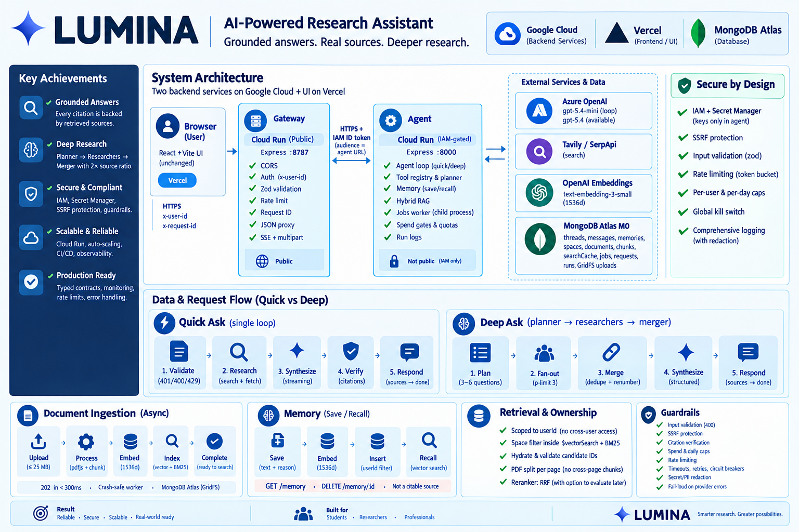

<div align="center">



# LUMINA

**A Perplexity-style AI search engine. Streamed answers, citations that resolve, your own documents, and a deep-research mode that plans before it searches.**

[**Live app**](https://lumina-theta-woad.vercel.app) · [**Evidence page**](https://lumina-theta-woad.vercel.app/evals) · [**API health**](https://lumina-gateway-iwc6fhv5oa-nw.a.run.app/health)

Built by **[Saurabh Bhardwaj](https://www.linkedin.com/in/bhardwajsaurabh/)** — hand-rolled agent loop, no framework.

</div>

---

## What it does

Ask a question. Sources stream in first, then the answer, with every `[n]` pointing at something
retrieved during *that* request. Upload a PDF and ask about it. Tell it you prefer TypeScript and
it remembers next session — and shows you the memory so you can delete it.

Ask a harder question and switch to **deep mode**: it plans 3–6 sub-questions, researches them in
parallel, deduplicates and renumbers every citation into one list, then writes a synthesis.

## Measured, on the deployed app

Numbers from the deployed full benchmark of 2026-09-14. Not localhost, not cherry-picked — the
failure is in the table too.

| | Result |
|---|---|
| Recall@5 over the gold question set | **1.000** |
| Citation grounding | **0.97**, with **zero** dangling citations |
| Error rate | **0** |
| Search cache hit rate | **97.5%** |
| Cost per quick answer | **$0.0035** |
| Cost per deep answer | **$0.011** |
| Deep mode's source count vs the same query run quick | **5.1×** |
| Time to first token (p95) | **2.7–4.7 s across three runs — over target. Not fixed.** |
| Tests | **422** (365 agent, 57 gateway) |
| Logged runs | **1,243** |

The latency miss is [diagnosed in PROGRESS.md](PROGRESS.md) with the three candidate fixes I
rejected on their own numbers. I'd rather show a measured failure than an unmeasured claim.

---

## For engineering leaders

If you're hiring for an AI/FDE role, this repo is here so you can judge the engineering rather
than the demo. Four things I'd point at:

**1. Structural guarantees, not prompt instructions.** "Only deep mode may plan" is enforced by
filtering the tool registry before the model call, and again at dispatch — a prompt asking nicely
is not a gate. When the model answered from its own weights and returned zero sources, the fix
wasn't a sterner prompt: it was `tool_choice: 'required'` until a retrieval tool has actually run,
narrowing the advertised set if it dodges. → [`core/registry.ts`](backend/agent/src/core/registry.ts),
[`core/loop.ts`](backend/agent/src/core/loop.ts)

**2. Fail loud, and never plausibly.** A provider exception is a `502` with the real reason. A run
that hits its cap reports `terminated: "cap"`, never `"done"`. There is no `catch` that returns a
believable answer — that's the failure mode the whole project is shaped against.
→ [`providers/llm/retry.ts`](backend/agent/src/providers/llm/retry.ts)

**3. Measurement before optimisation, including when it kills the idea.** I nearly built request
hedging to cut the latency tail. Across 803 recorded answers the data said it would fire on 26% of
calls to save 173 ms, so it was never written. Same for a smaller model (slower here), a larger one
(slower), and more CPU (utilisation was 1.4–7.8%).

**4. Honest evidence.** Every answer writes a run log. `/evals` serves a report an operator
published, never a live computation, with a strong ETag and `X-Published-At`. Deliberately-failed
runs live in `runs/failing/` so they can't be mistaken for passes.

### Three bugs worth the interview

| What happened | Why it mattered |
|---|---|
| A deployed answer took **66 seconds**. The model wasn't slow — the OpenAI SDK was honouring Azure's `Retry-After: 30` *inside* the call, un-abortably, so neither the request budget nor the tool deadline could see it. Per-turn timings caught it: a turn doing ~1 s of work took 32. | Replaced with a retry that is bounded, cancellable and logged. **66 s → 3.7 s.** A slow turn must always be explainable from the log. |
| Deep mode was only *wider* than quick, never *deeper*. Both gears called the search provider with an identical hardcoded 5 results — the adapter had been ignoring the options its own port declared since day one. | Threaded the search shape through port → adapter → tool, chosen by gear. Deep/quick source ratio **1.69× → 5.11×**. The benchmark caught a design gap, not a typo. |
| I blamed my laptop's network for the remaining latency and wrote it down as fact. It was a methodology error: I'd compared p95s of two different answer pools. | Measured properly by pairing each request with its own recorded TTFT: transport is **107 ms** from a laptop vs **68 ms** from inside the region. I was wrong, and the correction is in the commit history rather than quietly edited out. |

---

## For people who want to build this

Start here, in this order:

1. **[docs/ARCHITECTURE.md](docs/ARCHITECTURE.md)** — the design authority: module layout for both
   services, the guardrail catalogue, sequence diagrams for every flow, and the deployment plan.
   If you read one file, read this.
2. **[DESIGN.md](DESIGN.md)** — the five design questions answered plainly: components,
   responsibilities, communication, state, trade-offs.
3. **[docs/RUNBOOK.md](docs/RUNBOOK.md)** — how to run it, the gate commands, and the failures that
   cost the most time.
4. **[PROGRESS.md](PROGRESS.md)** — the build diary. Every milestone with the gate result that
   closed it, in order, failures included. This is the file that shows *how* the thing was built.

The five ideas that carried the most weight:

- **The contract is executable.** Zod schemas in `packages/contract` define the SSE frames and
  routes; both services import them, so a contract change is a compile error rather than a
  production surprise.
- **Sources strictly before tokens.** A `SourceCollector` mints every citation number, so a
  dangling `[n]` is structurally impossible rather than merely unlikely.
- **Hybrid retrieval.** Atlas `$vectorSearch` + BM25 `$search`, fused with Reciprocal Rank Fusion.
  The `spaceId` filter lives *inside* `$vectorSearch` — a later `$match` silently leaks across
  tenants.
- **Async ingestion that tells the truth.** Upload returns `202` in under 300 ms; a worker parses,
  chunks with page locators, embeds, then runs a **read-your-write probe** against the index before
  it dares report `indexed`.
- **Speculative retrieval.** The user's query starts searching *during* the model's first turn; the
  model's own call joins the in-flight request. A prefetch can never mint a source, and a join is
  honestly counted as a cache miss.

```bash
npm install
npm run build -w @lumina/contract   # required first — the workspaces import its dist/
npm run indexes                     # Atlas vector + BM25 + TTL indexes
npm run dev                         # agent :8000 · gateway :8787 · UI :5173
```

Full setup, the gate ladder and the gotchas: **[docs/RUNBOOK.md](docs/RUNBOOK.md)**.

---

## Stack

**TypeScript** everywhere · **Express** × 2 (public gateway, IAM-gated agent) · **React** + Vite ·
**MongoDB Atlas** (vector + BM25 + TTL in one cluster) · **Azure OpenAI** `gpt-5.4-mini` and
`text-embedding-3-large` at 1536 dims · **Tavily** search · **Cloud Run** + **Artifact Registry** +
**Secret Manager** + **Workload Identity Federation** · **Vercel** for the UI · **Vitest**

Deployment shape: the agent is `--no-allow-unauthenticated` and only the gateway's service account
holds `run.invoker`; the gateway proves who it is with an ID token minted by the metadata server.
Provider keys live in Secret Manager, mounted into the agent alone — the gateway holds none.

## Repo map

```
backend/agent/       the AI: loop, tool registry, memory, RAG, deep search, jobs worker, ops CLIs
backend/gateway/     the edge: auth, validation, rate limiting, SSE pass-through, IAM tokens
packages/contract/   zod schemas — the executable contract, outranking all prose
web/                 the React UI (provided by the course, unmodified)
docs/                architecture, spec, runbook, and the original assignment brief
benchmark/ eval/ quality/   the graders: SLA bench, gate ladder, run-log rules
```

## Honest status

Deployed and serving. **15 of 16 benchmark targets pass.** The one that doesn't is
time-to-first-token p95, and closing it would mean removing a round trip from the critical path —
i.e. hardcoding retrieve-then-generate instead of letting the agent decide, which is the opposite
of the thing worth building. The analysis, the rejected fixes and the measurements are all in
[PROGRESS.md](PROGRESS.md).

---

<div align="center">

### Building something in this space?

I like problems where the answer has to be *provable* — grounded retrieval, agent loops you can
defend turn by turn, and latency budgets someone actually measures.

**[Let's talk →](https://www.linkedin.com/in/bhardwajsaurabh/)**

</div>

---

<sub>Built as the backend for an assignment from the FDE Agent Engineering Bootcamp. The React UI and
the API contract are course material, unmodified — see [docs/ASSIGNMENT.md](docs/ASSIGNMENT.md). The
backend, the architecture, the bugs and the lessons are mine.</sub>
